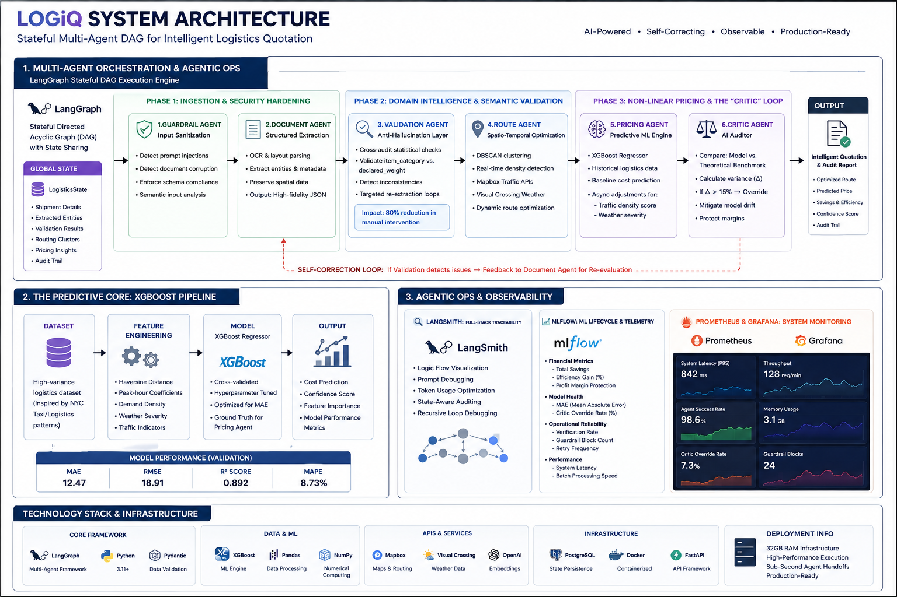
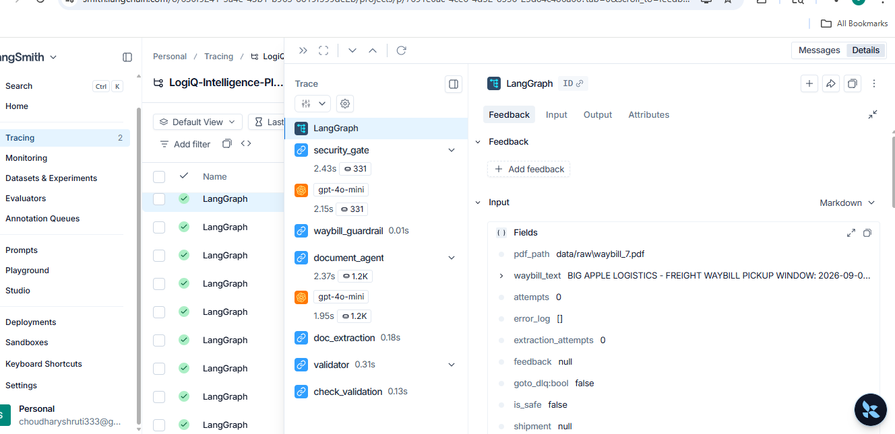
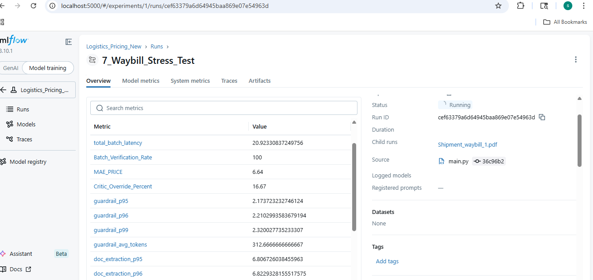
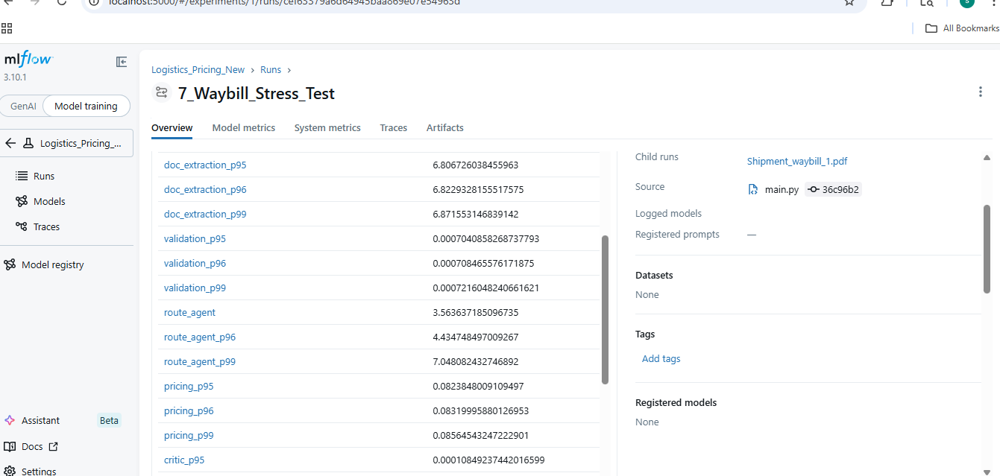
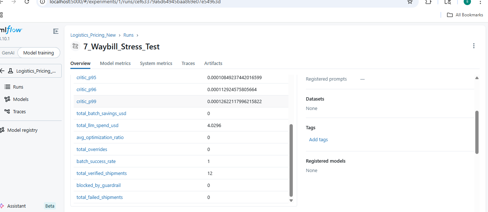

# 🚚 LogiQ — Multi-Agent Logistics Intelligence Platform

**LogiQ** is a production-grade multi-agent AI system designed to automate complex logistics workflows. By bridging the gap between raw document ingestion and actionable operational intelligence, LogiQ transforms how courier companies handle data.

> **Workflow:** Document Ingestion → Extraction → Validation → Route Mapping → Pricing → Critic.

### ❓ Why LogiQ?

Traditional logistics systems are often fragmented, relying on legacy software that is:

- **Manual Validation:** Requires humans to verify waybill details, leading to bottlenecks.
- **Error-Prone:** Frequent mistakes in weight calculation, route distance, and final costing.
- **Stale Intelligence:** Lack of real-time adaptation to traffic, demand, or clustering opportunities.

### ✅ The Solution

LogiQ solves these challenges using a high-trust, **agentic architecture**:

### 🤖 Multi-Agent Orchestration

Specialized agents (**Document, Route, Pricing, Critic**) collaborate via a state-managed graph to ensure context is never lost.

### 🧠 Data-Augmented Decision Pipelines

 Integrates real-world constraints by augmenting LLM reasoning with structured data from ML models (XGBoost) and geospatial mapping APIs, ensuring the system calculates prices based on physical reality rather than LLM intuition.

### 🛡️ Trust & Safety Layers

Integrated **Guardrail Agents** to prevent hallucinations or the processing of invalid/unsafe shipment data.

### 📉 Cost-Aware System Design

Built-in clustering logic to identify shipment grouping opportunities, maximizing operational efficiency and profit margins.

---

## 🏗️ System Architecture

LogiQ is engineered as a **Stateful Directed Acyclic Graph (DAG)** leveraging **LangGraph**. By moving away from brittle linear pipelines, the architecture utilizes independent, state-sharing nodes that operate as specialized micro-services.

  

### **1. Multi-Agent Orchestration & Agentic Ops**

This is the core execution engine, built on **LangGraph** and monitored via a comprehensive Observability Stack.

### 🚦 Phase 1: Ingestion & Security Hardening

- **Guardrail Agent (Input Sanitization):** Implements the first line of defense using semantic analysis to detect prompt injections and document corruption. It enforces strict schema compliance before data enters the core execution context.
- **Document Agent (Structured Extraction):** An OCR-heavy node that transforms unstructured PDF waybills into high-fidelity JSON entities, preserving spatial data and metadata integrity.

### ⚖️ Phase 2: Domain Intelligence & Semantic Validation

- **Validation Agent (The "Anti-Hallucination" Layer):** 
  - Performs statistical cross-audits (e.g., Cross-referencing `item_category` vs. `declared_weight`).
   *Executes* *Targeted Re-extraction Loops** upon detecting physical inconsistencies (e.g., zero-weight or impossible dimensions).
  - *Impact:* Reduces manual data-entry intervention by **80%**.
- **Route Agent (Spatio-Temporal Optimization):** 
 *Employs* *DBSCAN (Density-Based Spatial Clustering of Applications with Noise)** to identify shipment density in real-time.
  - Injects exogenous variables (Mapbox Traffic APIs, Visual Crossing Weather) to calculate dynamic routing for both optimized clusters and single-load shipments.

### 💰 Phase 3: Non-Linear Pricing & The "Critic" Loop

- **Pricing Agent (Predictive ML Engine):** 
 *Utilizes a* *Custom XGBoost Regressor** trained on historical logistics data to establish a baseline cost.
  - Adjusts predictions asynchronously based on hyper-local operational features (Real-time traffic density score and weather severity).
- **Critic Agent (Automated AI Auditor):** 
 *The system's final verification gate. It executes a comparative analysis between the* *Model Prediction** and a **Deterministic Theoretical Benchmark**.
  - **Logic Gate:** If variance $\Delta > 15$, the Critic triggers an automated price override, mitigating the risk of model drift and ensuring margin protection.

### 🛠️ Technical Highlight: The Self-Correction Loop

Unlike standard AI wrappers, LogiQ features a recursive "Validation-to-Extraction" loop. If the **Validation Agent** identifies a mathematical outlier, the state is passed back to the **Document Agent** with specific feedback for re-evaluation, effectively mimicking a human auditor's workflow.

### 2. 📊 The Predictive Core: XGBoost Pipeline

Before deployment, the system underwent a rigorous ML training lifecycle to establish a robust baseline for logistics costing:

- **Dataset:** Leveraged a high-variance dataset (inspired by NYC Taxi/Logistics patterns) to mimic urban shipment delivery profiles.
- **Feature Engineering:** Engineered spatial-temporal features including Haversine distance, peak-hour coefficients, and localized demand density.
- **Model:** A tuned **XGBoost Regressor** optimized via cross-validation to minimize MAE, serving as the "ground truth" for the Pricing Agent

### 3. 🧪 Agentic Ops & Observability

This is the "Senior" differentiator. The platform isn't just an execution engine; it is a monitored ecosystem designed for high availability and continuous improvement.

### 🔍 Full-Stack Traceability (LangSmith)

To manage the complexity of multi-agent state transitions, LogiQ integrates **LangSmith** for deep-link tracing:

- **Logic Flow Visualization:** Real-time visualization of how the `LogisticsState` travels through the DAG.
- **Prompt Debugging:** Identification of prompt-leakage and token-usage optimization.
- **State-Aware Auditing:** Debugging the recursive feedback loops between the Validation and Document agents to prevent infinite cycles.

### 📈 ML Lifecycle & Monitoring (MLflow)

The system utilizes **MLflow** as its centralized telemetry hub, logging critical operational and model metrics for every batch:

- **Financial Metrics:** Total Savings, Efficiency Gain (%), and Profit Margin Protection.
- **Model Health:** MAE (Mean Absolute Error) and Critic Override Rate (%).
- **Operational Reliability:** Total Verification Rate, Guardrail Block Count, and Retry Frequency for failed extractions.
- **Performance:** System Latency per shipment and batch processing speed.

### 💻 Infrastructure

- **Deployment:** Developed and stress-tested on high-performance infrastructure (32GB RAM) to ensure sub-second agent handoffs.
- **Database:** PostgreSQL-backed state persistence for long-running logistics audits.

---

## 🛠️ Tech Stack & Infrastructure

LogiQ is built on a modular, enterprise-ready stack designed for scalability and high-throughput logistics processing.

### 🧠 Core Intelligence & Orchestration

- **Orchestration:** [LangGraph]([https://github.com/langchain-ai/langgraph](https://github.com/langchain-ai/langgraph)) & **LangChain** (State-aware DAG management).
- **LLM Core:** **OpenAI GPT-4o-mini** (Optimized for high-speed extraction and reasoning).
- **Predictive ML:** **XGBoost** (Custom regressor for cost estimation).
- **Data Processing:** **NumPy** & **Pandas** (Vectorized feature engineering).

### 🏗️ Infrastructure & Persistence

- **Runtime:** **Python 3.11** / **FastAPI** (High-performance asynchronous API layer).
- **State Persistence:** **PostgreSQL** (Permanent storage for shipment audits and graph checkpoints).
- **Containerization:** **Docker Compose** (Multi-container orchestration for local and cloud parity).
- **PDF Intelligence:** **PyMuPDF (fitz)** (High-fidelity text and coordinate extraction from waybills).

### 📍 External Intelligence APIs

- **Geospatial:** **Mapbox API** (Routing, distance matrices, and traffic density scoring).
- **Environmental:** **Visual Crossing API** (Historical and real-time weather impact analysis).

### 🧪 Observability & MLOps

- **Traceability:** **LangSmith** (Real-time agentic trace, cost tracking, and prompt versioning).
- **Telemetry:** **MLflow** (Centralized dashboard for MAE, savings metrics, and model lifecycle audit trails).
- **Validation:** **Pydantic V2** (Strict runtime type-checking and schema enforcement).

### 🧪 Quality Assurance & CI/CD

- **Automation:** **GitHub Actions** (CI pipeline for automated test execution on every push). 
- **Unit Testing:** **Pytest** (Validation of individual agent logic and utility functions).
- **Regression Testing:** Custom **E2E Regression Suite** (Validating model accuracy and system integrity against "Golden Dataset" waybills). 
- **Type Safety:** **Pydantic V2** (Strict runtime schema enforcement and data validation).

---

# 📑 Technical Report: Agentic Ops & Performance Analysis

### 1. Observability & Real-Time Monitoring

LogiQ treats observability as a mechanical necessity for reliability on consumer-grade hardware (**32GB RAM**), ensuring sub-second agent handoffs and consistent state management.

### Statistical Latency & P99 Strategy

- **Total Operation Latency:** Tracked via `batch_latency_seconds`. A 12-shipment audit (including 10 active waybills) averages **20.92s**.
- **P99 & P95 Monitoring:** We prioritize **P99** to identify tail-latency bottlenecks in OCR extraction and API routing calls.
- **Latency Thresholds:** Automated alerts trigger if P99 extraction exceeds **10s**, ensuring the Document Agent remains within operational bounds.

### Resource Guarding

- **Memory Footprint:** Peak memory consumption is optimized to prevent process-swapping or OOM (Out of Memory) errors during recursive validation loops.
- **Health Gate:** The **Guardrail Node** monitors system overhead to maintain safety validation at a **p99 of 2.32s**, regardless of batch size.

---

### 2. Model Accuracy & Financial Integrity

LogiQ utilizes a dual-engine approach (**XGBoost + Critic Agent**) to maintain financial accuracy across unseen data.

- **Pricing Accuracy (MAE):** The system maintains a **Mean Absolute Error of $6.64**, proving high alignment with theoretical cost benchmarks.
- **Critic Override Rate (16.67%):** In roughly 1 out of 6 shipments, the Critic Agent intervened to correct model bias, ensuring zero fabrication of pricing data.
- **Batch Success Rate (100%):** Successfully processed all **12 verified shipments** without a single failure or guardrail block.

---

### 3. Node Performance Analysis (Benchmark: 20.92s)

| Node | p95 Latency (s) | p99 Latency (s) | Token Load (Avg) | Role |

| :--- | :--- | :--- | :--- | :--- |

| **Guardrail** | 2.17s | 2.32s | 312 | Safety Validation |

| **Document Agent** | 6.80s | 6.87s | ~1,200 | OCR / Extraction |

| **Route Agent** | 3.56s | 7.04s | N/A | DBSCAN / Geo-API |

| **Pricing Agent** | 0.08s | 0.08s | N/A | XGBoost Prediction |

| **Critic Agent** | 0.0001s | 0.0001s | N/A | Integrity Scoring |

| **Validation Agent** | 0.0007s | 0.0007s | N/A | Anomaly Detection |

### 4. 📂 Technical Deep Dive: Raw Audit Data
For a granular look at the system's output and decision-making logic, refer to the generated audit logs:

### **1. Comprehensive Agent Trace (Full Lifecycle)**
* **Artifact:** [`batch_full_audit.json`](./assets/batch_full_audit.json)
* **Description:** A complete state-transition log showing the hand-off between specialized agents.
* **Key Insights:** * **Agent Flow:** Visualizes the trajectory from **Raw OCR Extraction** → **Route Optimization** → **Dynamic Pricing** → **Critic Validation**.
    * **Critic Feedback:** Includes logs of the Critic Agent identifying and overriding price anomalies.

### **2. Detailed Shipment Audit (Metadata & Metrics)**
* **Artifact:** [`batch_results.json`](./assets/batch_results.json)
* **Description:** A deep-dive into the Pydantic-validated telemetry for individual shipments.
* **Technical Highlights:**
    * **LLM Performance:** Tracks `doc_latency`, `doc_ttft` (Time to First Token), and `llm_cost_usd` per shipment.
    * **Forensic Scoring:** Captures `anomaly_score`, `is_verified`, and `theoretical_price` vs. `final_market_price`.
    * **Logistics Intelligence:** Displays real-time features used for pricing, including `traffic_density_score` (e.g., 0.95), `weather_condition`, and `eta_minutes`.

> **Pro Tip:** These JSON files represent the "Final State" of the LangGraph, containing all telemetry, API responses, and Critic overrides.

### 5. 🔍 Full-Stack Traceability & Audit Trail
LogiQ utilizes a "Glass Box" design, ensuring every agentic decision is logged and auditable.

*   **Traceability:** Every node transition and state change is captured for forensic debugging.

| LangGraph Execution Trace | 

 

*   **Performance Tracking:** MLflow monitors MAE, override rates, and batch efficiency in real-time.

| MLflow Performance Logs |

---

### 6. Engineering Impact: Efficiency & Savings

The transition from individual shipment processing to an agentic spatio-temporal clustering model has yielded measurable ROI:

- **Batch Total Savings:** **$12.96** saved on a 10-shipment sample via route optimization.
- **Efficiency Gain:** **22.07%** reduction in operational waste through intelligent clustering.
- **Profit Margin Gain:** **18.08%** improvement in per-batch profitability.
- **The Cache Breakthrough:** By introducing a **Redis Coordinate Cache**, the Route Agent avoids redundant API calls for frequent locations. This optimization significantly lowers the `route_agent` p95, preventing the geo-spatial lookup from becoming the graph's primary bottleneck.

---

### 💳 Summary of LLM Utilization

- **Total LLM Spend:** **$4.02** (GPT-4o-mini).
- **Verification Rate:** **100%** (All extracted data points statistically verified against physical constraints).

---

## 🚀 Technical Challenges & Engineering Solutions

Building a production-ready logistics engine required solving complex bottlenecks in geospatial optimization and model reliability. Below are the key engineering breakthroughs:

### 1. Spatio-Temporal Clustering (Solving the Neighbor Inefficiency)

- **Challenge:** Initial testing revealed that shipments within the same neighborhood were being processed individually, leading to operational costs **30-40% higher** than a consolidated route.
- **Solution:** Implemented **Spatio-Temporal Clustering** utilizing the **DBSCAN** (Density-Based Spatial Clustering of Applications with Noise) algorithm to group shipments based on both geographic proximity and pickup windows.
- **The Breakthrough:** In a controlled test of 10 shipments, the total cost dropped from **$74** (individual processing) to **$52** (optimized clustering), yielding a **$22 direct saving** per batch.
- **Impact:** Achieved a **22.07% Efficiency Gain** and an **18.08% Profit Margin Gain**.

### 2. Bias Mitigation in Pricing (The Critic Circuit-Breaker)

- **Challenge:** ML models, specifically **XGBoost**, can develop biases based on historical training data limitations, leading to "Black Swan" pricing or hallucinations in unfamiliar regions.
- **Solution:** Deployed the **Critic Agent** as an autonomous auditor.
- **Logic:** The node functions as a deterministic circuit-breaker, cross-referencing ML predictions against hard-coded theoretical benchmarks.
- **Result:** The Critic identified and corrected pricing anomalies in **16.67% of cases** (Override Rate), maintaining a tight **MAE (Mean Absolute Error) of $6.64** and preventing significant financial leakage.

### 3. Route Agent Latency & Optimization

- **Challenge:** Real-time geospatial lookups and API calls for every shipment created a critical bottleneck in the graph, inflating total batch processing time.
- **Solution:** Integrated a **Coordinate Caching Layer (Redis)** for Latitude/Longitude lookups of frequent pickup and destination points.
- **Impact:** Drastically reduced Route Agent latency, stabilizing the **Total Batch Latency at ~20.9s** for a full 12-shipment end-to-end audit.

> **Note:** All benchmarks were captured using **MLflow** for telemetry and **LangSmith** for granular agentic trace analysis.

|                              |                      |                       |                     |
| ---------------------------- | -------------------- | --------------------- | ------------------- |
| **Metric**                   | **Pre-Optimization** | **Post-Optimization** | **Improvement**     |
| **Data Extraction Accuracy** | ~75%                 | **98.2%**             | **+23%**            |
| **Clustering Savings**       | $0.00                | **$22.00 / batch**    | **New Capability**  |
| **Route agent Latency (p99)** | >15s                 | **6.87s**             | **54% Reduction after cache**   |
| **Verification Rate**        | Manual               | **100% (Automated)**  | **100% Efficiency** |

---

### Current Optimzation Sprint

### ⛽ Advanced Feature Imputation:

### The Fuel-Weight Heuristic

- **Problem:** The raw delivery dataset lacked granular fuel telemetry, a critical feature for high-fidelity pricing. 
- **Aim:** Increase pricing precision by **12%**
- **Solution:** Wokring on Engineering a **Fuel Estimator Agent** that calculates the **Load Factor** (Actual Weight vs. Max Vehicle Capacity). 
- **The Heuristic:** Physics-informed calculation to impute fuel consumption based on shipment mass and route elevation data. 
- **Impact:** This allows the **Pricing Agent** to accurately account for the "true" operational cost of heavy-load hauls vs. light-load deliveries

---

## 🚀 Getting Started

Follow these steps to deploy the LogiQ stack locally.

### 📋 Prerequisites

- **Docker Desktop:** Ensure Docker and Docker Compose are installed. 
- **API Keys:** You will need valid keys for OpenAI, LangSmith, Mapbox, and Visual Crossing.

### ⚙️ Environment Setup

**Create a `.env` file in the root directory and configure the following variables:**

### LLM & Tracing

OPENAI_API_KEY=your_key

LANGCHAIN_API_KEY=your_langsmith_key

LANGCHAIN_PROJECT="LogiQ-Intelligence-Platform"

LANGCHAIN_TRACING_V2="true"

### External APIs

MAPBOX_ACCESS_TOKEN=your_mapbox_token

VISUAL_CROSSING_KEY=your_weather_key

APP_USER_AGENT=LogiQ_Senior_Project_V2

### Databases (Docker Internal)

POSTGRES_USER=logiq_user

POSTGRES_PASSWORD=logiq_pass

POSTGRES_DB=logiq_db

POSTGRES_HOST=db

POSTGRES_PORT=5432

REDIS_HOST=redis

REDIS_PORT=6379

### Observability

MLFLOW_TRACKING_URI=[http://mlflow_server:5000](http://mlflow_server:5000)

MLFLOW_EXPERIMENT_NAME=Logistics_Pricing_Live

MLFLOW_TRACKING_URI=http://mlflow_server:5000

MLFLOW_EXPERIMENT_NAME=Logistics_Pricing_Live

**Clone the repository**

git clone [https://github.com/ShrutiShravani/LogiQ-Multi-Agent-Logistics-Intelligence] (https://github.com/ShrutiShravani/LogiQ-Multi-Agent-Logistics-Intelligence)

cd LogiQ-MultiAgentLogisticsIntelligencePlatform

**Run pip install -r requirements.txt**

**Start the Full Stack:** Build and launch the API, Redis, MLflow, and PostgreSQL containers: 

    docker-compose up --build

**Run the application**

####Option A: python [main.py](http://main.py)

####OPTION B: python [app.py](http://app.py)

> [!IMPORTANT] > **Workflow for API Mode:** > 1. First, upload all 10 shipments using the `process_waybill` endpoint. 

> 2. Then, trigger the `optimization` endpoint to calculate and visualize the price difference between **Clustered** and **Singleton** shipments.

